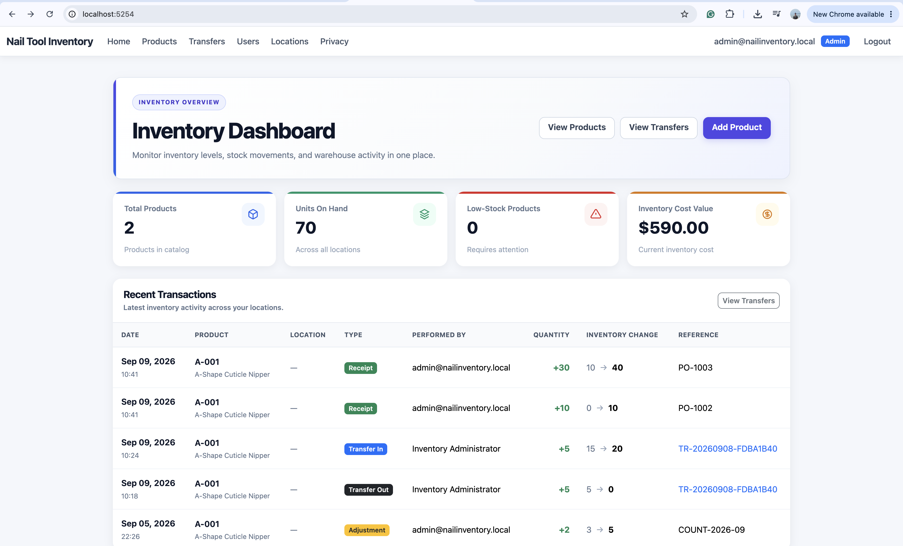
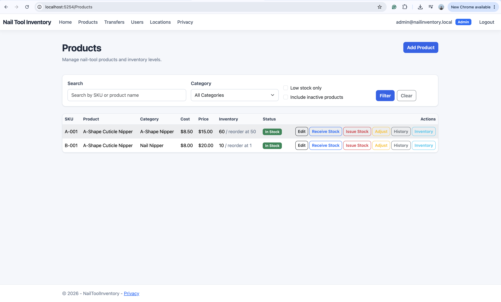
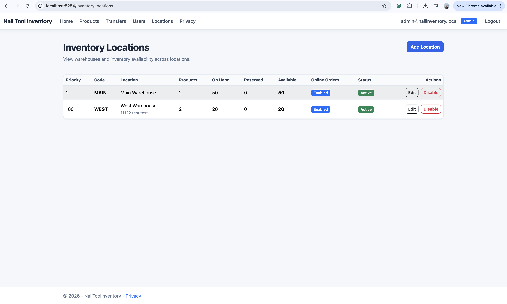
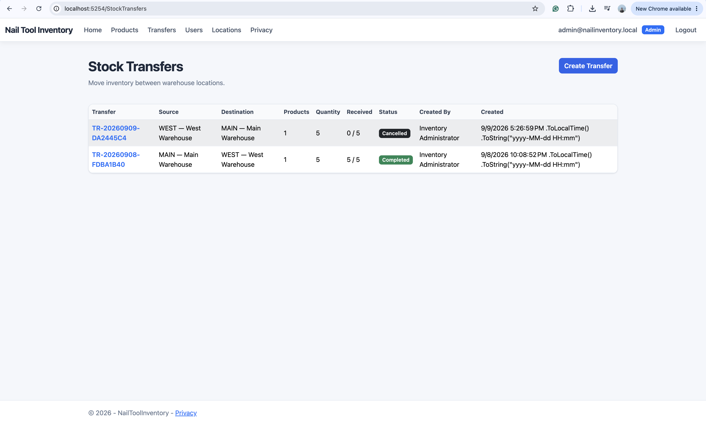
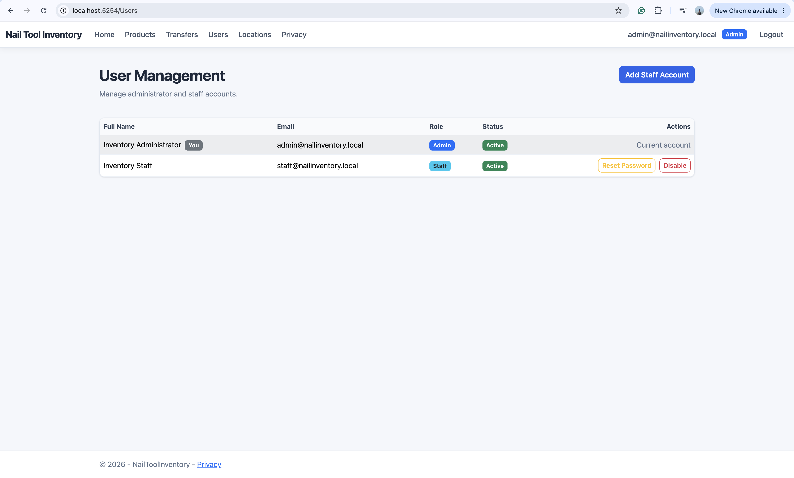

# Nail Tool Inventory

Nail Tool Inventory is a role-based inventory management application built with ASP.NET Core MVC. It supports product management, inventory tracking across multiple warehouse locations, stock movements, warehouse transfers, user administration, and an auditable transaction history.

This project was created as a portfolio application to demonstrate practical C#, ASP.NET Core, Entity Framework Core, relational data modeling, authorization, testing, and inventory workflow design.

## Application Preview

### Inventory Dashboard



### Product Management



### Inventory by Location



### Stock Transfers



### User Management



## Key Features

- Inventory dashboard with product totals, units on hand, low-stock alerts, inventory value, and recent activity.
- Product creation, editing, searching, filtering, categories, pricing, SKU validation, and active/inactive status.
- Multi-location inventory with per-location on-hand, reserved, available, and reorder quantities.
- Stock receipt, issue, and physical-count adjustment workflows.
- Warehouse-to-warehouse stock transfers with Draft, In Transit, Completed, and Cancelled states.
- Transaction audit trail containing the user, location, timestamp, reference, quantity, and before/after inventory values.
- ASP.NET Core Identity authentication with Admin and Staff roles.
- Administrator user management, including creating staff accounts, resetting passwords, and enabling or disabling accounts.
- Server-side validation, authorization checks, and protection against invalid inventory operations.
- Responsive Bootstrap interface suitable for desktop and mobile use.

## Roles and Permissions

| Capability | Admin | Staff |
| --- | :---: | :---: |
| View dashboard and products | Yes | Yes |
| Perform daily inventory operations | Yes | Yes |
| View stock transfers | Yes | Yes |
| Receive an in-transit transfer | Yes | Yes |
| Create, ship, or cancel transfers | Yes | No |
| Manage products and locations | Yes | No |
| Manage user accounts | Yes | No |

Authorization is enforced on the server. Hiding an action in the interface is not treated as a security boundary.

## Stock Transfer Workflow

1. An administrator creates a transfer between two different inventory locations.
2. The transfer begins in `Draft` status and does not change inventory.
3. Shipping the transfer deducts the requested quantities from the source location and changes the status to `In Transit`.
4. Receiving the transfer adds the quantities to the destination location and changes the status to `Completed`.
5. A draft transfer may be cancelled before inventory leaves the source location.
6. Transfer-out and transfer-in transactions are recorded in the inventory audit history.

## Technology Stack

| Area | Technology |
| --- | --- |
| Language | C# |
| Framework | ASP.NET Core MVC (.NET 10) |
| Data access | Entity Framework Core |
| Database | SQLite |
| Authentication | ASP.NET Core Identity |
| Authorization | Role-based authorization |
| UI | Razor Views, Bootstrap, CSS |
| Testing | xUnit |
| Source control | Git and GitHub |

## Main Domain Models

- `Product` — product identity, SKU, category, prices, status, and inventory information.
- `InventoryLocation` — warehouse/location configuration and fulfillment settings.
- `InventoryLevel` — inventory quantities for one product at one location.
- `InventoryTransaction` — immutable record of a receipt, issue, adjustment, transfer out, or transfer in.
- `StockTransfer` — transfer header, source, destination, status, audit information, and timestamps.
- `StockTransferItem` — product and quantity associated with a transfer.
- `ApplicationUser` — authenticated application user managed by ASP.NET Core Identity.

## Project Structure

```text
NailToolInventory/
├── docs/
│   └── screenshots/
├── src/
│   └── NailToolInventory.Web/
│       ├── Areas/Identity/
│       ├── Controllers/
│       ├── Data/
│       │   └── Migrations/
│       ├── Models/
│       ├── ViewModels/
│       ├── Views/
│       └── wwwroot/
├── tests/
│   └── NailToolInventory.Tests/
├── dotnet-tools.json
└── NailToolInventory.sln
```

## Getting Started

### Prerequisites

- .NET 10 SDK
- Git

SQLite is used locally, so a separate database server is not required.

### Installation

Clone the repository and enter the project directory:

```bash
git clone https://github.com/baothanhquach1661/NailToolInventory.git
cd NailToolInventory
```

Restore the local .NET tools and application dependencies:

```bash
dotnet tool restore
dotnet restore
```

Create or update the local database:

```bash
dotnet tool run dotnet-ef database update \
  --project src/NailToolInventory.Web/NailToolInventory.csproj \
  --startup-project src/NailToolInventory.Web/NailToolInventory.csproj
```

Build the solution:

```bash
dotnet build NailToolInventory.sln
```

Run the application:

```bash
dotnet run \
  --project src/NailToolInventory.Web/NailToolInventory.csproj
```

Open the local address displayed in the terminal.

## Running Tests

Run all automated tests from the repository root:

```bash
dotnet test NailToolInventory.sln
```

## Database Migrations

After changing an Entity Framework model, create a migration with:

```bash
dotnet tool run dotnet-ef migrations add MigrationName \
  --project src/NailToolInventory.Web/NailToolInventory.csproj \
  --startup-project src/NailToolInventory.Web/NailToolInventory.csproj
```

Then apply it:

```bash
dotnet tool run dotnet-ef database update \
  --project src/NailToolInventory.Web/NailToolInventory.csproj \
  --startup-project src/NailToolInventory.Web/NailToolInventory.csproj
```

## Development Notes

- Development accounts and roles are created by the identity seeding process.
- Seeded passwords must be changed before using the application outside a local development environment.
- The SQLite database and generated build output should not be committed to source control.
- Inventory-changing operations are validated on the server and recorded as transactions for traceability.

## Portfolio Highlights

This project demonstrates:

- Designing an inventory domain with multi-location stock.
- Maintaining inventory consistency across transactional workflows.
- Modeling and implementing a state-based warehouse transfer process.
- Applying authentication and role-based authorization in ASP.NET Core.
- Using Entity Framework Core migrations and relational constraints.
- Separating controllers, domain models, view models, and Razor views.
- Building operational audit trails and user-management workflows.

## Future Improvements

- Partial transfer receiving and discrepancy handling.
- Purchase order and supplier management.
- Inventory reservations for online orders.
- Barcode scanning.
- Deployment to a cloud-hosted SQL database.

---

Built as a portfolio project for demonstrating practical ASP.NET Core and inventory-management development skills.
