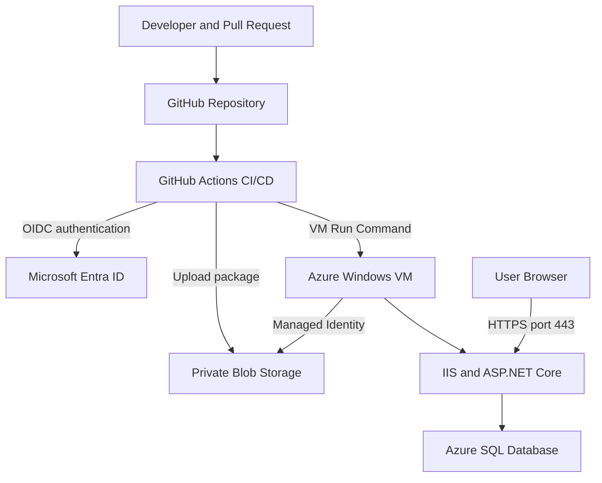

# Nail Tool Inventory

[](https://github.com/baothanhquach1661/NailToolInventory/actions/workflows/dotnet.yml)

Nail Tool Inventory is a role-based, multi-location inventory management application built with ASP.NET Core MVC and deployed to Microsoft Azure.

The application supports product management, inventory tracking, stock receipts, issues, adjustments, warehouse transfers, user administration, and an auditable transaction history.

This portfolio project demonstrates full-stack .NET development, relational data modeling, authentication and authorization, automated testing, Azure infrastructure, Windows Server/IIS administration, HTTPS configuration, and secure CI/CD deployment.

## Live Application

**Production URL:** https://nailtool-inventory-bao.westus2.cloudapp.azure.com

Authentication is required. Demo credentials and production secrets are never stored in the repository.

## Application Preview

### Inventory Dashboard


### Product Management


### Inventory by Location


### Stock Transfers


### User Management


## Key Features

- Inventory dashboard showing product totals, units on hand, low-stock alerts, inventory value, and recent activity.
- Product creation, editing, searching, filtering, category management, pricing, SKU validation, and active/inactive status.
- Multi-location inventory with per-location on-hand, reserved, available, and reorder quantities.
- Stock receipt, issue, and physical-count adjustment workflows.
- Warehouse-to-warehouse transfers using Draft, In Transit, Completed, and Cancelled states.
- Transaction audit history containing the user, location, timestamp, reference, quantity, and before/after values.
- ASP.NET Core Identity authentication with Admin and Staff roles.
- Administrator account management, including staff creation, password reset, enable, and disable controls.
- Server-side validation and authorization for inventory-changing operations.
- Responsive Razor and Bootstrap interface for desktop and mobile use.

## Roles and Permissions

| Capability | Admin | Staff |
| --- | :---: | :---: |
| View dashboard and products | Yes | Yes |
| Perform daily inventory operations | Yes | Yes |
| View stock transfers | Yes | Yes |
| Receive an in-transit transfer | Yes | Yes |
| Create, ship, or cancel transfers | Yes | No |
| Manage products and locations | Yes | No |
| Manage user accounts | Yes | No |

Authorization is enforced on the server. Hiding a button in the user interface is not treated as a security boundary.

## Stock Transfer Workflow

1. An administrator creates a transfer between two different inventory locations.
2. The transfer starts in `Draft` status and does not immediately change inventory.
3. Shipping deducts the requested quantities from the source and changes the transfer to `In Transit`.
4. Receiving adds the quantities to the destination and changes the transfer to `Completed`.
5. A draft transfer can be cancelled before inventory leaves the source location.
6. Transfer-out and transfer-in transactions are recorded in the audit history.

## Technology Stack

| Area | Technology |
| --- | --- |
| Language | C# |
| Application framework | ASP.NET Core MVC (.NET 10) |
| Data access | Entity Framework Core |
| Database | Azure SQL Database / SQL Server |
| Authentication | ASP.NET Core Identity |
| Authorization | Admin and Staff role-based authorization |
| UI | Razor Views, Bootstrap, CSS |
| Testing | xUnit |
| Web server | Internet Information Services (IIS) |
| Operating system | Windows Server on Azure Virtual Machine |
| Cloud platform | Microsoft Azure |
| Deployment storage | Private Azure Blob Storage |
| CI/CD | GitHub Actions |
| Deployment automation | PowerShell and Azure VM Run Command |
| Cloud authentication | Microsoft Entra ID with GitHub OIDC |
| Server authentication | Azure Managed Identity |
| TLS certificate | Let’s Encrypt with win-acme |
| Source control | Git and GitHub |

## Cloud Architecture



### Responsibility by Layer

| Layer | Responsibility |
| --- | --- |
| Azure Portal | VM, Public IP, DNS, NSG, port `443`, Storage, Azure SQL, Managed Identity, and RBAC |
| Windows Server | IIS, Application Pool, Certificate Store, HTTPS binding, deployment folders, and scheduled certificate renewal |
| ASP.NET Core | Business rules, Identity, authorization, validation, inventory workflows, and database access |
| GitHub Actions | Build, test, package, authenticate to Azure, deploy, verify, and report status |
| Azure SQL Database | Relational production data |
| Azure Blob Storage | Temporary private storage for versioned deployment packages |

RDP is only an administration method for controlling Windows Server. Closing the RDP session does not stop IIS, the certificate, or the application.

## CI/CD Pipeline

The workflow is defined in:

```text
.github/workflows/dotnet.yml
```

### Pull Request Validation

Every pull request targeting `main` runs:

1. Repository checkout.
2. .NET 10 SDK setup.
3. Local tool restoration.
4. NuGet dependency restoration.
5. Release build.
6. All xUnit tests.
7. PowerShell deployment-script syntax validation.

Production deployment is intentionally skipped for pull requests.

### Production Deployment

A push or merge to `main` performs the following:

1. Build and test the solution.
2. Publish a framework-dependent Windows `win-x64` package.
3. Create a ZIP deployment artifact.
4. Authenticate to Azure using GitHub OIDC.
5. Upload the package to a private Blob Storage container.
6. Start the Azure VM when necessary.
7. Invoke `scripts/Deploy-Iis.ps1` through Azure VM Run Command.
8. Download the package using the VM system-assigned Managed Identity.
9. Verify the package SHA-256 checksum.
10. Back up the current IIS application.
11. Stop the IIS Application Pool.
12. deploy the new files.
13. Restart the Application Pool.
14. Run a local health check.
15. Run a public HTTPS health check.
16. Keep the deployment when healthy or restore the previous backup when unhealthy.

Deployment concurrency prevents two production deployments from running at the same time.

## Deployment Safety and Rollback

The PowerShell deployment script provides:

- Strict error handling.
- SHA-256 package-integrity verification.
- Timestamped deployment and backup folders.
- Controlled IIS Application Pool stop/start operations.
- Local application health checks.
- Automatic rollback after an unhealthy deployment.
- Retention of the five most recent backups.
- Deployment transcript logs for troubleshooting.
- A `DEPLOYMENT_SUCCEEDED` marker required by GitHub Actions.

Local ZIP files and extracted deployment directories are excluded through `.gitignore`.

## Security Design

- No Azure client secret is used by GitHub Actions.
- GitHub authenticates through an OIDC federated credential.
- The Azure application identity receives only the RBAC permissions required for deployment.
- The deployment container is private.
- The VM downloads packages through its system-assigned Managed Identity.
- Storage account keys and SAS tokens are not embedded in the workflow.
- The Azure SQL connection string is stored outside source control.
- GitHub Actions configuration values are stored as repository variables.
- Production credentials are not committed to Git.
- Reusable GitHub Actions are pinned to specific commit SHAs.
- Application authorization is enforced on the server.
- Public traffic is encrypted with HTTPS.
- win-acme renews the Let’s Encrypt certificate through Windows Task Scheduler.

## Azure SQL Startup Resilience

Azure SQL may require additional time to become available after an idle period. Database access is configured with:

```csharp
ConnectTimeout = 60
```

Entity Framework Core also retries transient SQL failures:

```csharp
sqlServerOptions.EnableRetryOnFailure(
    maxRetryCount: 5,
    maxRetryDelay: TimeSpan.FromSeconds(10),
    errorNumbersToAdd: new[] { -2 });
```

SQL error `-2` represents a connection timeout. Adding it to the retry policy prevents a temporary Azure SQL startup delay from immediately terminating the IIS worker process.

## Troubleshooting Case Study

The first production CI/CD deployment successfully authenticated to Azure, uploaded the package, and reached the IIS server. However, the application returned `HTTP 500` during the health check.

The deployment script detected the unhealthy application and automatically restored the previous version.

The issue was investigated through:

```text
Event Viewer
└── Windows Logs
    └── Application
```

Important events included:

- `IIS AspNetCore Module V2`, Event ID `1007`
- `.NET Runtime`, Event ID `1026`

The detailed stack trace showed:

```text
Microsoft.Data.SqlClient.SqlException
Connection Timeout Expired
Error Number: -2
```

The exception occurred while `IdentitySeeder` accessed Azure SQL during application startup. The resolution was to increase the connection timeout and explicitly retry SQL error `-2`.

The following deployment completed successfully, demonstrating the complete detection, rollback, troubleshooting, and recovery process.

## Main Domain Models

- `Product` — product identity, SKU, category, prices, status, and inventory information.
- `InventoryLocation` — warehouse or location configuration.
- `InventoryLevel` — quantities for one product at one location.
- `InventoryTransaction` — immutable receipt, issue, adjustment, transfer-out, or transfer-in record.
- `StockTransfer` — transfer source, destination, status, audit information, and timestamps.
- `StockTransferItem` — product and quantity belonging to a transfer.
- `ApplicationUser` — authenticated user managed through ASP.NET Core Identity.

## Project Structure

```text
NailToolInventory/
├── .github/
│   └── workflows/
│       └── dotnet.yml
├── docs/
│   └── screenshots/
├── scripts/
│   └── Deploy-Iis.ps1
├── src/
│   └── NailToolInventory.Web/
│       ├── Areas/
│       │   └── Identity/
│       ├── Controllers/
│       ├── Data/
│       │   └── Migrations/
│       ├── Models/
│       ├── ViewModels/
│       ├── Views/
│       └── wwwroot/
├── tests/
│   └── NailToolInventory.Tests/
├── .gitignore
├── dotnet-tools.json
├── NailToolInventory.sln
└── README.md
```

## Getting Started

### Prerequisites

- .NET 10 SDK
- Git
- SQL Server or Azure SQL Database

For IIS deployment:

- Windows Server
- IIS
- ASP.NET Core Hosting Bundle for .NET 10

### Installation

Clone the repository:

```bash
git clone https://github.com/baothanhquach1661/NailToolInventory.git
cd NailToolInventory
```

Restore tools and dependencies:

```bash
dotnet tool restore
dotnet restore
```

Configure the database connection string using .NET User Secrets:

```bash
dotnet user-secrets set "ConnectionStrings:DefaultConnection" \
  "<YOUR_SQL_CONNECTION_STRING>" \
  --project src/NailToolInventory.Web/NailToolInventory.csproj
```

Configure development seed accounts:

```bash
dotnet user-secrets set "SeedAdmin:Email" "<ADMIN_EMAIL>" \
  --project src/NailToolInventory.Web/NailToolInventory.csproj

dotnet user-secrets set "SeedAdmin:Password" "<ADMIN_PASSWORD>" \
  --project src/NailToolInventory.Web/NailToolInventory.csproj

dotnet user-secrets set "SeedAdmin:FullName" "Administrator" \
  --project src/NailToolInventory.Web/NailToolInventory.csproj

dotnet user-secrets set "SeedStaff:Email" "<STAFF_EMAIL>" \
  --project src/NailToolInventory.Web/NailToolInventory.csproj

dotnet user-secrets set "SeedStaff:Password" "<STAFF_PASSWORD>" \
  --project src/NailToolInventory.Web/NailToolInventory.csproj

dotnet user-secrets set "SeedStaff:FullName" "Staff User" \
  --project src/NailToolInventory.Web/NailToolInventory.csproj
```

Apply Entity Framework Core migrations:

```bash
dotnet tool run dotnet-ef database update \
  --project src/NailToolInventory.Web/NailToolInventory.csproj \
  --startup-project src/NailToolInventory.Web/NailToolInventory.csproj
```

Build the solution:

```bash
dotnet build NailToolInventory.sln
```

Run the application:

```bash
dotnet run \
  --project src/NailToolInventory.Web/NailToolInventory.csproj
```

Open the local URL displayed in the terminal.

## Running Tests

Run all automated tests:

```bash
dotnet test NailToolInventory.sln
```

The current test suite contains 10 passing xUnit tests covering important inventory and application behavior.

## Database Migrations

After modifying an Entity Framework model, create a migration:

```bash
dotnet tool run dotnet-ef migrations add MigrationName \
  --project src/NailToolInventory.Web/NailToolInventory.csproj \
  --startup-project src/NailToolInventory.Web/NailToolInventory.csproj
```

Apply the migration:

```bash
dotnet tool run dotnet-ef database update \
  --project src/NailToolInventory.Web/NailToolInventory.csproj \
  --startup-project src/NailToolInventory.Web/NailToolInventory.csproj
```

Database migrations are intentionally not executed automatically during every production deployment. A controlled migration step is safer for future schema changes and rollback planning.

## Development Notes

- Development users and roles are created through the identity-seeding process.
- Seeded passwords must be changed before using the application outside local development.
- Connection strings, database passwords, user credentials, and generated build output must remain outside source control.
- Inventory-changing operations are validated on the server and recorded for traceability.
- Pull requests validate code before it reaches `main`.
- Only changes merged into `main` can trigger production deployment.

## Portfolio Highlights

This project demonstrates the ability to:

- Design a relational, multi-location inventory domain.
- Maintain stock consistency across transactional workflows.
- Implement a state-based warehouse-transfer process.
- Create an immutable inventory audit trail.
- Apply authentication and role-based authorization.
- Manage users through ASP.NET Core Identity.
- Use Entity Framework Core migrations and relational constraints.
- Write and run automated xUnit tests.
- Administer an Azure Windows Server and IIS environment.
- Configure DNS, networking, TLS certificates, and certificate renewal.
- Implement secretless GitHub-to-Azure authentication with OIDC.
- Apply Azure RBAC and Managed Identity.
- Build a private-artifact CI/CD delivery process.
- Automate IIS deployment with PowerShell.
- Detect unhealthy deployments and automatically roll back.
- Troubleshoot application startup through GitHub Actions logs and Windows Event Viewer.

## Future Improvements

- Partial transfer receiving and discrepancy handling.
- Purchase-order and supplier management.
- Inventory reservations for online orders.
- Barcode scanning.
- Azure Key Vault integration.
- Azure Application Insights, dashboards, and alerts.
- Private endpoints for Azure SQL and Blob Storage.
- Protected GitHub deployment environments with manual approval.
- A controlled production database-migration job.
- Blue-green or zero-downtime IIS deployment.

---

Built by Bao T. Quach as a hands-on ASP.NET Core, Azure, and DevOps portfolio project.