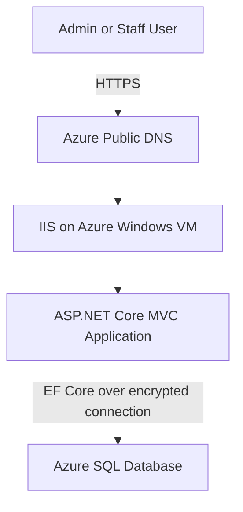
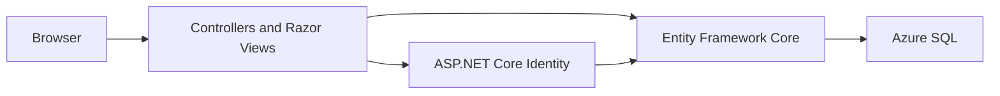
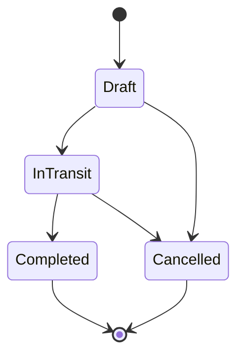
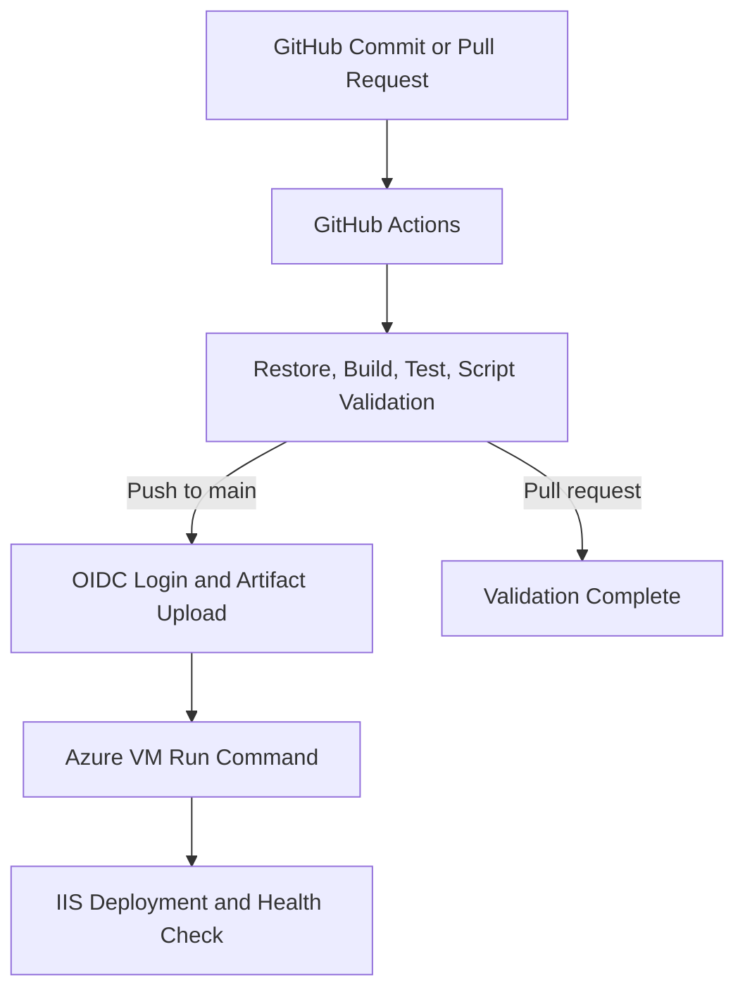

# System Architecture

This document describes the application, Azure infrastructure, security boundaries, runtime flow, and CI/CD deployment architecture of Nail Tool Inventory.

## System Summary

| Component | Technology |
|---|---|
| Application | ASP.NET Core MVC on .NET 10 |
| Authentication | ASP.NET Core Identity |
| Data access | Entity Framework Core |
| Database | Azure SQL Database |
| Web server | IIS on Windows Server |
| Hosting | Azure Virtual Machine |
| CI/CD | GitHub Actions |
| Deployment automation | PowerShell and Azure VM Run Command |
| Artifact storage | Private Azure Blob Storage |
| Cloud authentication | Microsoft Entra ID with GitHub OIDC |
| Server authentication | VM System-Assigned Managed Identity |
| HTTPS | Let's Encrypt certificate managed by win-acme |

## Runtime Architecture

### Request Flow

1. A user opens the public HTTPS URL.
2. Azure DNS resolves the hostname to the VM's public IP address.
3. The Azure Network Security Group permits HTTPS traffic on port 443.
4. IIS receives the request and forwards it to the ASP.NET Core application.
5. ASP.NET Core Identity authenticates the user and applies role authorization.
6. Entity Framework Core reads or updates inventory data in Azure SQL.
7. The application generates an MVC response and returns it through IIS.

## Application Architecture

### Application Responsibilities

| Layer | Responsibility |
|---|---|
| Controllers | Process requests and coordinate application behavior |
| Razor Views | Render the user interface |
| ASP.NET Core Identity | Login, password management, users, and roles |
| Authorization | Restrict operations according to Admin and Staff roles |
| ApplicationDbContext | Map application and Identity entities to Azure SQL |
| Domain models | Represent products, locations, inventory, receipts, issues, adjustments, and transfers |
| IdentitySeeder | Create required roles and initial administrative data |
| Migrations | Track controlled database schema changes |

## Main Business Workflow

The application maintains inventory across multiple warehouse locations.

A stock transfer follows this lifecycle:

Inventory is not treated as a single global quantity. Each product can have a separate quantity at each location, and every movement is recorded for auditability.

## Azure Infrastructure

| Azure resource | Purpose |
|---|---|
| Resource Group | Organizes the project resources |
| Windows Virtual Machine | Runs Windows Server, IIS, and the application |
| Public IP and DNS label | Provides a stable public endpoint |
| Network Security Group | Controls inbound network access |
| Azure SQL Database | Stores application and Identity data |
| Storage Account | Stores deployment packages |
| Private Blob Container | Prevents public access to deployment artifacts |
| Microsoft Entra App Registration | Represents the GitHub Actions deployment identity |
| Federated Credential | Allows GitHub Actions to authenticate without a client secret |
| VM Managed Identity | Allows the VM to download deployment artifacts |
| Azure RBAC | Limits each identity to its required Azure permissions |

## Identity and Security Boundaries

The system uses three separate identity types.

| Identity | Used by | Purpose |
|---|---|---|
| Application user identity | Admin and Staff users | Access application features |
| GitHub OIDC identity | GitHub Actions | Upload artifacts and invoke deployment |
| VM Managed Identity | Windows VM | Download packages from private Blob Storage |

### GitHub Actions Identity

GitHub Actions authenticates to Azure through Microsoft Entra workload identity federation.

The workflow sends a short-lived GitHub OIDC token to Microsoft Entra ID. Entra validates that the token belongs to the approved repository and branch before issuing an Azure access token.

This design avoids storing a permanent Azure client secret in GitHub.

### VM Managed Identity

The VM uses its System-Assigned Managed Identity to download deployment packages from the private Blob container.

The VM does not require a Storage Account access key or SAS token in the deployment script.

### Application Secrets

The Azure SQL connection string is stored as a Windows machine environment variable on the VM. It is not committed to Git and is not stored in the GitHub Actions workflow.

## CI/CD Architecture

## Pull Request Validation

For pull requests, the workflow performs:

1. Repository checkout.
2. .NET SDK setup.
3. Dependency restore.
4. Release build.
5. Execution of all xUnit tests.
6. PowerShell syntax validation for `scripts/Deploy-Iis.ps1`.

Production deployment is skipped for pull requests.

## Production Deployment

A push or merge to `main` starts the production deployment process:

1. Build and test the solution.
2. Publish the application for Windows `win-x64`.
3. Create a versioned ZIP deployment package.
4. Generate a SHA-256 checksum.
5. Authenticate to Azure through OIDC.
6. Upload the package to the private Blob container.
7. Start the VM if it is deallocated.
8. Invoke Azure VM Run Command.
9. Run `scripts/Deploy-Iis.ps1` inside the VM.
10. Verify the application locally through IIS.
11. Verify the public HTTPS endpoint.

## Deployment Inside the VM

The deployment script performs the following operations:

1. Validate all required parameters.
2. Create a temporary working directory.
3. Authenticate to Blob Storage with the VM Managed Identity.
4. Download the deployment ZIP.
5. Calculate and verify its SHA-256 checksum.
6. Extract the deployment package.
7. Create a backup of the current IIS application.
8. Stop the IIS application pool.
9. Mirror the new application files into the IIS directory.
10. Start the IIS application pool.
11. Run repeated local health checks.
12. Report a successful deployment only after the application becomes healthy.
13. Retain the five most recent backups.

## Automatic Rollback

If the deployed application does not become healthy:

1. The deployment is marked as failed.
2. The new application files are removed.
3. The previous backup is restored.
4. The IIS application pool is restarted.
5. The rollback result is written to the deployment log.
6. GitHub Actions receives a failed exit code.

This prevents a failed release from permanently replacing the last working version.

## Azure SQL Startup Resilience

Application startup requires Azure SQL because `IdentitySeeder` runs before `app.Run()`.

The application therefore includes:

- A 60-second SQL connection timeout.
- Five retry attempts.
- A maximum delay of ten seconds between retries.
- SQL error `-2` as an explicitly retryable timeout error.

This protects application startup from temporary Azure SQL availability or connection delays.

## HTTPS Architecture

HTTPS is configured on the Windows VM:

1. The public DNS name points to the VM.
2. Azure networking permits inbound HTTPS traffic.
3. win-acme requests and installs a Let's Encrypt certificate.
4. The certificate is stored in the Windows Certificate Store.
5. IIS binds the certificate to port 443.
6. A Windows Scheduled Task renews the certificate automatically.

RDP is only used to administer the server. Closing an RDP session does not stop IIS or the website.

## Deployment Permissions

| Identity | Scope | Role |
|---|---|---|
| GitHub deployment identity | Deployment Blob container | Storage Blob Data Contributor |
| GitHub deployment identity | Azure VM | Virtual Machine Contributor |
| VM Managed Identity | Deployment Blob container | Storage Blob Data Reader |

Permissions are scoped to the resources required by the deployment process instead of granting subscription-wide administrative access.

## Failure Detection

| Failure | Detection or mitigation |
|---|---|
| Build error | GitHub Actions build fails |
| Test regression | xUnit test job fails |
| Invalid PowerShell | Parser validation fails |
| OIDC authentication failure | Azure login step fails |
| Blob upload failure | Deployment stops before VM execution |
| Corrupted package | SHA-256 verification fails |
| IIS startup failure | Local health check fails |
| Application HTTP 500 | Deployment rolls back |
| Azure SQL timeout | Extended timeout and retry policy |
| Public DNS or HTTPS failure | Public endpoint health check fails |
| VM deallocated | Website remains offline until the VM is started |

## Troubleshooting Example

The first production deployment successfully authenticated to Azure, uploaded its artifact, and executed the VM deployment script. However, IIS returned HTTP 500 during the local health check.

Windows Event Viewer showed:

- IIS AspNetCore Module V2 Event ID 1007.
- .NET Runtime Event ID 1026.
- SQL connection timeout error `-2`.
- Failure during `IdentitySeeder` before `app.Run()`.

The deployment script automatically restored the previous version. The application was then updated with a longer SQL connection timeout and an explicit retry policy for error `-2`. The next deployment completed successfully.

This incident demonstrated that a successful build does not guarantee a healthy production application and that runtime health checks and rollback are necessary.

## Operational Characteristics

- The website is available only while the Azure VM is running.
- A deallocated VM does not serve web traffic.
- Closing RDP does not stop the VM.
- The CI/CD workflow can start the VM before deployment.
- The current workflow deploys on every push to `main`, including documentation-only changes.
- VM disks, Azure SQL, Storage, and networking may continue to incur costs while the VM is deallocated.
- The architecture uses a single VM and is not designed for high availability.

## Design Decisions and Tradeoffs

| Decision | Benefit | Tradeoff |
|---|---|---|
| Windows VM and IIS | Demonstrates Windows Server and IIS administration | Requires patching, monitoring, and cost management |
| Azure SQL | Managed relational database suitable for production | Application startup depends on network database availability |
| GitHub OIDC | Removes long-lived Azure client secrets | Requires accurate federated credential configuration |
| Private Blob Storage | Protects deployment packages | Requires Azure RBAC and Managed Identity |
| Framework-dependent publish | Produces a smaller package | VM must have the compatible .NET runtime |
| Automatic rollback | Protects the last working release | Requires backup storage and deployment logic |
| Identity seeding during startup | Ensures required roles exist | A database delay can postpone application startup |
| Single VM | Simple and affordable for a portfolio lab | No redundancy during VM failure or shutdown |

## Future Improvements

- Skip production deployment for documentation-only changes.
- Configure scheduled VM start and auto-shutdown.
- Add Azure Cost Management budget alerts.
- Store production secrets in Azure Key Vault.
- Add Application Insights and centralized logging.
- Restrict administrative network access.
- Add protected GitHub deployment environments.
- Move database migrations into a controlled deployment stage.
- Evaluate Azure App Service or multiple instances for higher availability.