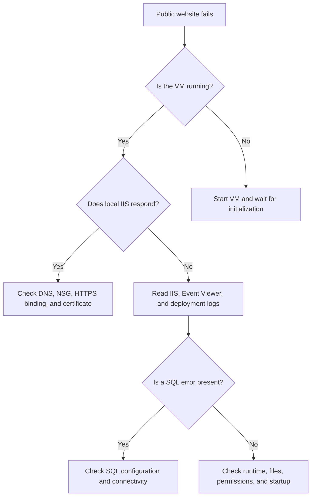

# Troubleshooting Guide

This guide documents the troubleshooting method used for Nail Tool Inventory across GitHub Actions, Azure, Windows Server, IIS, ASP.NET Core, and Azure SQL.

The main rule is:

> Identify the failing layer before changing the system.

Restarting services or changing code without evidence can hide the original problem and create additional failures.

## Troubleshooting Method

Use this sequence for every incident:

1. **Observe** the exact symptom.
2. **Determine the scope** of the failure.
3. **Identify the last successful layer**.
4. **Collect evidence** from logs and commands.
5. **Form one testable hypothesis**.
6. **Make the smallest relevant change**.
7. **Verify locally and in production**.
8. **Document the root cause and resolution**.

## System Layers

| Layer | Examples |
|---|---|
| Client | Browser, cache, DNS resolution |
| Azure network | Public IP, DNS label, NSG, port 443 |
| Azure compute | VM power state and VM Agent |
| Windows Server | Operating system, environment variables, certificates |
| IIS | Website, application pool, bindings, ASP.NET Core Module |
| ASP.NET Core | Runtime, application startup, middleware, Identity |
| Data | Entity Framework Core, Azure SQL, migrations |
| CI/CD | GitHub Actions, OIDC, artifacts, Azure Run Command |
| Business logic | Inventory calculations, roles, transfers, validation |

## Public Website Decision Tree



## Step 1: Record the Symptom

Before changing anything, record:

- Date and time.
- Production URL.
- Git commit being deployed.
- GitHub Actions run number.
- VM power state.
- Browser result.
- HTTP status code, if available.
- Last successful deployment.
- Recent infrastructure or application changes.

Examples of useful symptoms:

- The browser keeps loading without a response.
- The website returns HTTP 500.
- GitHub Actions fails before Azure login.
- GitHub Actions authenticates but cannot upload the package.
- The VM deployment runs but the local health check fails.
- Local IIS works but the public HTTPS URL fails.
- Login works but an inventory operation fails.

## Step 2: Check the VM State

The website cannot respond while the VM is deallocated.

In Azure Portal:

```text
Azure Portal → Virtual Machines → nailtool-web-vm → Overview
```

Interpret the status:

| Status | Meaning |
|---|---|
| `Running` | VM compute is active |
| `Starting` | Windows and IIS are initializing |
| `Stopped` | VM may still be allocated |
| `Stopped (deallocated)` | VM compute is released and website is offline |

After starting the VM, allow Windows Server, IIS, ASP.NET Core, and Azure SQL time to initialize.

Closing an RDP window does not stop the VM.

## Step 3: Test the Public Endpoint

From macOS:

```bash
curl -I https://nailtool-inventory-bao.westus2.cloudapp.azure.com
```

For detailed TLS and connection information:

```bash
curl -Iv https://nailtool-inventory-bao.westus2.cloudapp.azure.com
```

Possible results:

| Result | Likely area |
|---|---|
| Connection timeout | VM, public IP, NSG, or network |
| DNS resolution failure | DNS label or local DNS |
| Certificate warning | Certificate or IIS HTTPS binding |
| HTTP 200 | Request completed successfully |
| HTTP 301 or 302 | Expected redirect may be occurring |
| HTTP 401 or 403 | Authentication or authorization |
| HTTP 404 | Route, endpoint, or IIS site configuration |
| HTTP 500 | Application startup or runtime failure |

## Step 4: Compare Public and Local Results

Connect to the VM through RDP and open PowerShell as Administrator.

Import IIS management commands:

```powershell
Import-Module WebAdministration
```

Check the IIS site:

```powershell
Get-Website -Name "NailToolInventory" |
    Select-Object Name, State, PhysicalPath
```

Check the application pool:

```powershell
Get-WebAppPoolState -Name "NailToolInventoryAppPool"
```

Test the production hostname through the local IIS server:

```powershell
curl.exe -k --resolve nailtool-inventory-bao.westus2.cloudapp.azure.com:443:127.0.0.1 `
    https://nailtool-inventory-bao.westus2.cloudapp.azure.com/
```

Interpretation:

| Local result | Public result | Likely cause |
|---|---|---|
| Success | Success | Application is healthy |
| Failure | Failure | IIS, ASP.NET Core, runtime, or SQL |
| Success | Failure | DNS, NSG, public IP, port 443, or certificate binding |
| Failure | Success | Test command or local binding mismatch |

## Step 5: Check IIS

### Website State

```powershell
Get-Website -Name "NailToolInventory"
```

### Application Pool State

```powershell
Get-WebAppPoolState -Name "NailToolInventoryAppPool"
```

### Restart Only After Collecting Evidence

```powershell
Restart-WebAppPool -Name "NailToolInventoryAppPool"
```

Do not repeatedly restart the application pool before reading the failure logs. A restart can remove useful timing information and make the incident harder to diagnose.

### Confirm the Deployment Directory

```powershell
Get-ChildItem "C:\inetpub\NailToolInventory" |
    Select-Object Name, Length, LastWriteTime
```

Look for:

- Application DLL files.
- `web.config`.
- Configuration files.
- Recently deployed timestamps.
- Missing or unexpectedly empty directories.

## Step 6: Read Windows Event Viewer

Open:

```text
Event Viewer → Windows Logs → Application
```

Review errors at the exact deployment or startup time.

Important providers:

- `.NET Runtime`
- `IIS AspNetCore Module V2`
- `Application Error`

PowerShell alternative:

```powershell
Get-WinEvent -FilterHashtable @{
    LogName = "Application"
    StartTime = (Get-Date).AddMinutes(-30)
} |
    Where-Object {
        $_.ProviderName -in @(
            ".NET Runtime",
            "IIS AspNetCore Module V2",
            "Application Error"
        )
    } |
    Select-Object TimeCreated, ProviderName, Id, LevelDisplayName, Message
```

Read the complete exception, including:

- Exception type.
- Inner exception.
- SQL error number.
- Source file.
- Method name.
- Stack trace.
- Whether failure occurred before `app.Run()`.

The first visible IIS error is not always the root cause. The deeper `.NET Runtime` exception often contains the actionable evidence.

## Step 7: Check the .NET Runtime

On the VM:

```powershell
dotnet --info
```

Verify that the server has a compatible .NET runtime and ASP.NET Core Hosting Bundle for the framework-dependent deployment.

If the application was published for a newer runtime than the VM supports, IIS cannot start it successfully.

## Step 8: Check Production Configuration Safely

Verify that the SQL connection environment variable exists without displaying its secret value:

```powershell
[bool][Environment]::GetEnvironmentVariable(
    "ConnectionStrings__DefaultConnection",
    "Machine"
)
```

Expected result:

```text
True
```

If it returns `False`:

1. Confirm the variable name.
2. Confirm it was stored at Machine scope.
3. Restart the application pool after correcting the configuration.
4. Never paste the complete connection string into GitHub, screenshots, or public logs.

## Step 9: Check Azure SQL Connectivity

A SQL failure may occur because of:

- Temporary connection delay.
- Azure SQL availability.
- Firewall configuration.
- Incorrect server or database name.
- Incorrect credentials.
- Missing environment variable.
- Network connectivity.
- Database migration mismatch.

Test whether the SQL endpoint is reachable from the VM:

```powershell
Test-NetConnection <sql-server>.database.windows.net -Port 1433
```

Replace `<sql-server>` with the server hostname without exposing usernames or passwords.

A successful TCP test proves that the network port is reachable. It does not prove that the credentials, database name, or SQL permissions are correct.

## Step 10: Diagnose GitHub Actions by Stage

Do not treat every workflow failure as a deployment failure. Identify the exact failed stage.

| Failed stage | Primary investigation |
|---|---|
| Restore | NuGet sources or project configuration |
| Build | Compilation errors |
| Test | Regression or test configuration |
| PowerShell validation | Script syntax |
| Azure login | OIDC or GitHub variables |
| Artifact upload | Workflow path or artifact generation |
| Blob upload | Storage name or RBAC |
| Start VM | VM name, resource group, or RBAC |
| VM Run Command | VM Agent or PowerShell execution |
| Local health check | IIS, ASP.NET Core, configuration, or SQL |
| Public health check | DNS, NSG, certificate, or public binding |

## Pull Request Behavior

For pull requests:

- Build and Test should run.
- PowerShell validation should run.
- Production deployment should be skipped.

A skipped deployment on a pull request is expected behavior, not a failure.

## OIDC Troubleshooting

If Azure login fails, check:

- `AZURE_CLIENT_ID`
- `AZURE_TENANT_ID`
- `AZURE_SUBSCRIPTION_ID`
- Entra App Registration status
- Federated Credential configuration
- GitHub repository owner
- Repository name
- Branch entity
- Azure role assignments

The federated credential must match the token subject generated for the repository and branch.

OIDC removes the need for a permanent client secret, but its subject matching is strict.

## Azure RBAC Troubleshooting

Separate the two Azure identities:

### GitHub Deployment Identity

Used to:

- Upload deployment packages.
- Start the VM.
- Invoke VM Run Command.

### VM Managed Identity

Used to:

- Download packages from private Blob Storage.

A successful GitHub Azure login does not prove that the VM Managed Identity can read Blob Storage.

Check the identity associated with the exact failed operation.

## Blob Storage Troubleshooting

If upload fails, inspect the GitHub deployment identity.

If download fails inside the VM, inspect the VM Managed Identity.

Confirm:

- Storage Account name.
- Blob container name.
- Package name.
- Package existence.
- Private access configuration.
- Correct role assignment.
- Correct role assignment scope.
- RBAC propagation time.

Do not solve a permissions error by making the container public.

## Checksum Troubleshooting

If the SHA-256 check fails:

1. Stop the deployment.
2. Do not bypass verification.
3. Confirm that the ZIP and checksum came from the same workflow run.
4. Confirm the Blob was not replaced.
5. Generate a new deployment package.
6. Redeploy through the normal pipeline.

Checksum validation protects the VM from deploying an incomplete or unexpected package.

## Deployment and Rollback Evidence

When a deployment fails, determine whether rollback completed.

Look for messages such as:

```text
Deployment failed
Rolling back
Rollback completed
```

If rollback succeeded:

- Production should return to the previous version.
- The GitHub workflow should still remain failed.
- Investigate the new release without modifying the restored production files.

If rollback failed:

- Keep the failed workflow logs.
- Inspect the backup directories.
- Follow the manual rollback section in `DEPLOYMENT-RUNBOOK.md`.

## Case Study: IIS HTTP 500 After First CD Deployment

### Initial Symptom

The first deployment after merging the CI/CD pipeline failed during:

```text
Deploy package to IIS
```

The workflow had already completed:

- GitHub checkout.
- Build and tests.
- OIDC Azure authentication.
- Artifact creation.
- Blob upload.
- VM startup.
- Azure VM Run Command.

This proved that GitHub authentication and artifact delivery were not the primary problem.

### Deployment Evidence

The VM deployment script reported:

```text
Local health check returned HTTP 500
```

The check repeated 30 times. The application did not become healthy within five minutes.

The script then reported:

```text
Rolling back
Rollback completed
```

Automatic rollback worked as designed.

### Windows Evidence

Event Viewer showed errors including:

- IIS AspNetCore Module V2, Event ID 1007.
- .NET Runtime, Event ID 1026.
- An unhandled application startup exception.

The .NET Runtime stack trace showed:

- `Connection Timeout Expired`.
- SQL error number `-2`.
- Failure inside `IdentitySeeder`.
- Failure before `app.Run()`.

### Root Cause

`IdentitySeeder.SeedAsync()` connects to Azure SQL before the web server begins accepting requests.

The original Entity Framework Core retry configuration used:

```csharp
errorNumbersToAdd: null
```

SQL timeout error `-2` was therefore not explicitly treated as retryable for this startup scenario.

The default connection timeout was also too short for the observed Azure SQL startup delay.

### Correction

The application was updated to:

- Build the SQL connection with `SqlConnectionStringBuilder`.
- Set `ConnectTimeout` to 60 seconds.
- Retry up to five times.
- Wait up to ten seconds between retries.
- Explicitly add SQL error `-2` to the retry list.

Conceptually:

```csharp
var sqlConnectionString = new SqlConnectionStringBuilder(connectionString)
{
    ConnectTimeout = 60
}.ConnectionString;
```

```csharp
sqlServerOptions.EnableRetryOnFailure(
    maxRetryCount: 5,
    maxRetryDelay: TimeSpan.FromSeconds(10),
    errorNumbersToAdd: new[] { -2 });
```

### Verification

The correction was validated by:

- Running all 10 xUnit tests locally.
- Running `git diff --check`.
- Opening a focused pull request.
- Passing pull-request CI.
- Merging the fix to `main`.
- Completing the production deployment successfully.
- Loading the public HTTPS website successfully.

### Lesson Learned

A green build proves that the application compiles and passes tests. It does not prove that the production environment can start the application.

Production deployment also requires:

- Runtime health checks.
- Environment-specific configuration.
- Database connectivity validation.
- Observable logs.
- Automatic rollback.

Increasing timeouts is appropriate for a verified transient delay. It does not correct invalid credentials, firewall rules, or incorrect configuration.

## Common Troubleshooting Mistakes

Avoid these mistakes:

- Changing multiple layers simultaneously.
- Restarting IIS before collecting logs.
- Assuming every HTTP 500 is an IIS configuration problem.
- Assuming successful OIDC login proves all RBAC permissions.
- Making private Blob Storage public to bypass permissions.
- Printing production connection strings.
- Disabling checksum verification.
- Bypassing failed tests.
- Deploying directly to `main` without a pull request.
- Treating a skipped PR deployment as an error.
- Forgetting that a deallocated VM makes the website unavailable.
- Forgetting that a main deployment can start the VM again.

## Incident Notes Template

Use this format for future incidents:

```markdown
## Incident Title

### Date and Time

### User Impact

### Last Known Working Version

### Failed Commit or Workflow

### Symptoms

### Evidence Collected

### Last Successful Layer

### Root Cause

### Corrective Change

### Validation

### Rollback Result

### Prevention or Follow-Up
```

## Interview Explanation

A concise interview explanation of the Azure SQL incident:

> My first automated IIS deployment reached the VM successfully, but the application returned HTTP 500 during its local health check. Because authentication, artifact upload, and VM Run Command had already succeeded, I focused on the Windows and application layers. Event Viewer showed a .NET Runtime exception caused by Azure SQL timeout error -2 during Identity seeding before app.Run. The deployment script automatically rolled back to the previous release. I added an extended SQL connection timeout and an explicit retry policy for error -2, validated all tests through a pull request, and the following production deployment succeeded.

This explanation demonstrates:

- Layer-by-layer troubleshooting.
- Log analysis.
- Azure and IIS knowledge.
- SQL resilience.
- Safe rollback.
- Git and pull-request discipline.
- Verification after correction.

## Final Troubleshooting Checklist

- [ ] Recorded the time, commit, and workflow run.
- [ ] Checked the VM power state.
- [ ] Tested the public URL.
- [ ] Compared local IIS and public results.
- [ ] Checked the IIS website and application pool.
- [ ] Read the complete Event Viewer exception.
- [ ] Verified the installed .NET runtime.
- [ ] Checked that production configuration exists.
- [ ] Checked Azure SQL connectivity when relevant.
- [ ] Identified the exact failed GitHub Actions stage.
- [ ] Identified which Azure identity performed the failed action.
- [ ] Confirmed whether rollback succeeded.
- [ ] Made one focused correction.
- [ ] Re-ran tests and CI.
- [ ] Verified the public application.
- [ ] Documented the root cause and lesson learned.